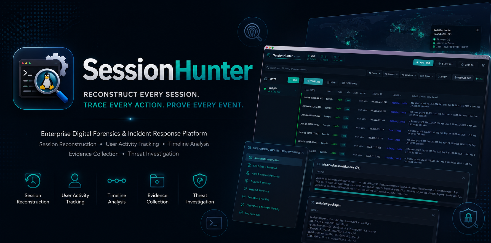
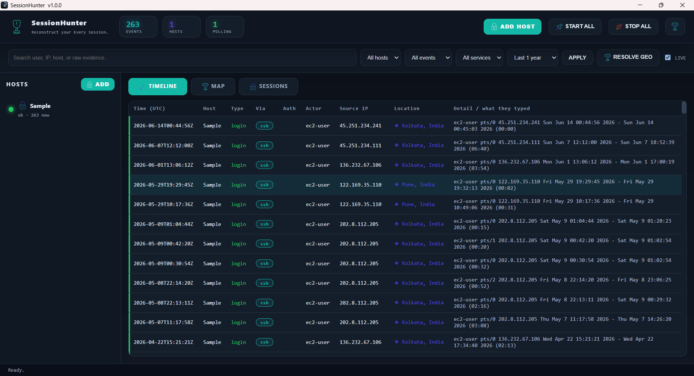
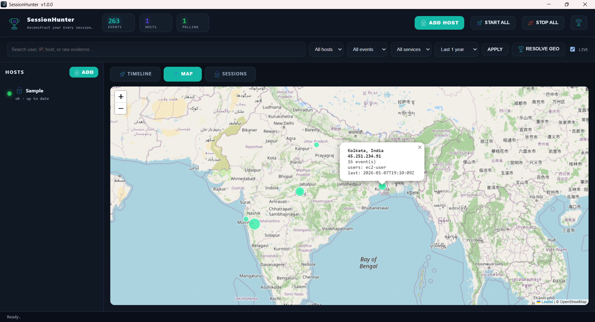
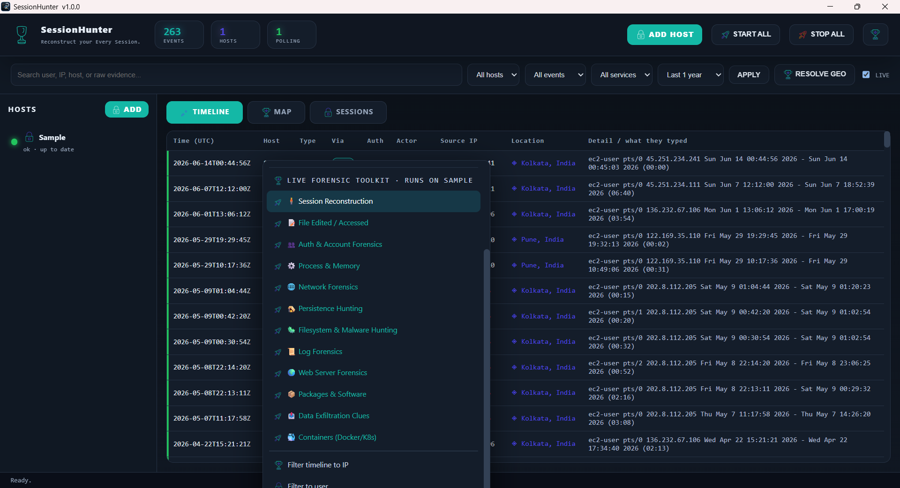
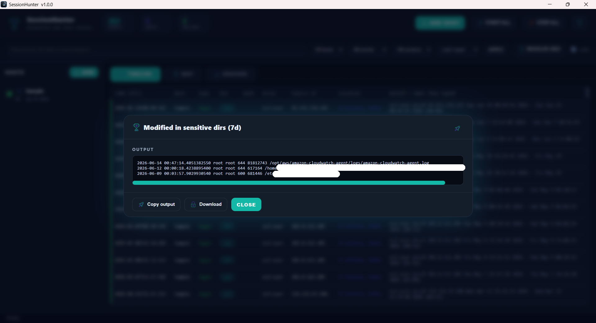
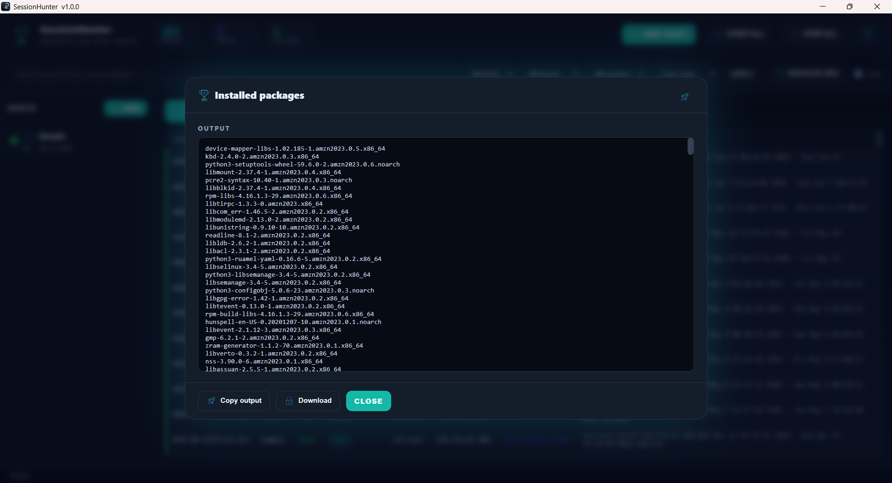
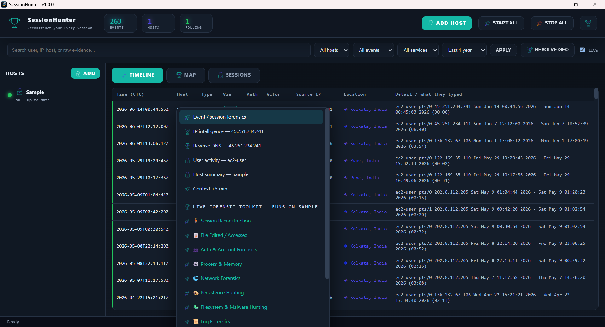
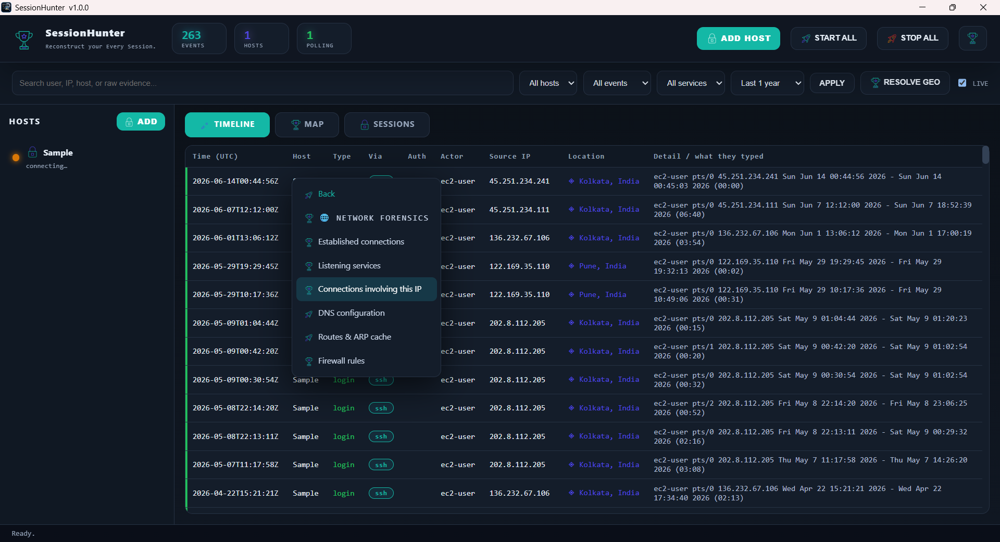
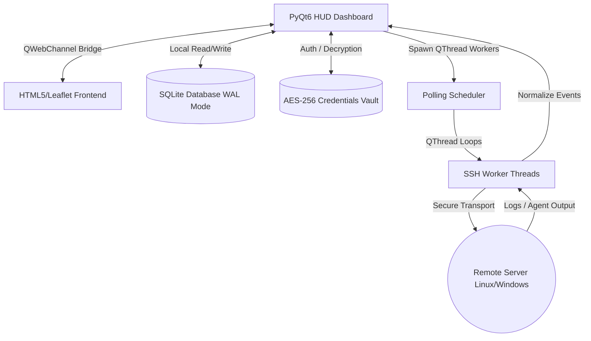

# <p align="center"></p>

<p align="center">
  
  
  
  
</p>

---

## 🔍 What is SessionHunter?

**SessionHunter** is a premium, standalone desktop forensic console built with **PyQt6** and **HTML5/JS**. It connects to remote Linux and Windows servers agentlessly (or via a lightweight agent) over a single **SSH transport** to reconstruct a comprehensive, unified forensic timeline of user activity: **who** logged in, **what** they typed, **from where**, and **when**.

All logs are automatically normalized into a local SQLite database, resolved against offline/online GeoIP databases, and rendered in a futuristic HUD-style interface. 

To protect intellectual property and ensure secure credential vaulting, **the application is distributed strictly as pre-compiled native machine binaries** (`.exe`, `.deb`, and portable formats). No Python source code is distributed.


---

## ✨ Key Features

*   **Unified Forensic Timeline**: Correlates authentication logs, terminal commands, process executions, and session activity into a single chronological view.
*   **Dual Mode Collection**:
    *   *Agentless*: Zero footprint on target host. Pulls and parses log files on demand.
    *   *Agent-assisted*: One-click copy-paste command installs a lightweight, tamper-resistant collector script to capture real-time execution flows.
*   **Futuristic HUD UI**: Dark-themed, neon-accented PyQt6 window embedded with a premium QtWebEngine dashboard, interactive maps (using Leaflet/OSM), and session flow charts.
*   **OS Autodetection**: Automatically detects host OS, log file locations, and calculates clock drift offsets.
*   **Deep Geolocation**: Integrates with local MaxMind GeoLite2-City databases and online GeoIP APIs to map log source IPs automatically.
*   **Secure Vaulting**: Encrypts target credentials using either the **OS Keyring** (Windows Credential Manager / Keychain) or a local **AES-256-Fernet vault** secured by a master password.

---

## 📸 Interface & Capabilities Showcase

### 📊 Main Dashboard & Event Timeline
The core timeline interface correlates events in real-time. It features host state cards, a neon-segmented navigation bar, and high-contrast timeline logs.
<p align="center">
  
</p>

### 🗺️ GeoIP Investigation Map
Visualizes login locations using Leaflet maps. Markers cluster based on geolocation data (city/country) to help security teams identify anomaly locations immediately.
<p align="center">
  
</p>

### 🛠️ Live Forensic Toolkit
Allows run-time query execution directly on connected endpoints. From this menu, users can execute specialized commands to inspect files, packages, and network state.
<p align="center">
  
</p>

### 📂 Forensic Detail Modules
Deep-dives into host configuration, file modifications, installed packages, and network states:
<p align="center">
  
  
</p>

### ⚙️ Contextual Analysis Menus
Security teams can right-click any event to launch dedicated lookup flows like reverse DNS, actor history, and contextual command tracking.
<p align="center">
  
  
</p>

---

## 🚀 Downloading and Running SessionHunter

All official releases are distributed in the **GitHub Releases** section. Download the appropriate package for your platform:

### 🪟 Windows Setup & Portable
*   **Windows Installer (`SessionHunter-v1.0.0-Windows-Setup.exe`)**: Standard installer wizard that sets up SessionHunter under `Program Files` and creates a desktop shortcut.
*   **Portable Binary (`SessionHunter-v1.0.0-Windows-Portable.exe`)**: Self-contained, zero-installation executable. Simply double-click and run from anywhere (USB drive, Desktop, etc.).
*   **Zip Archive (`SessionHunter-v1.0.0-Windows-x64.zip`)**: Hand-deployable folder structure containing all dependencies.

### 🐧 Linux builds (Debian / Ubuntu / Generic x64) ( UPCOMING! )
*   **Debian Package (`SessionHunter-v1.0.0-Linux-amd64.deb`)**: Installed system-wide using:
    ```bash
    sudo dpkg -i SessionHunter-v1.0.0-Linux-amd64.deb
    ```
*   **Portable Binary (`SessionHunter-v1.0.0-Linux-x64-Portable`)**: Standalone binary—make executable and run directly:
    ```bash
    chmod +x SessionHunter-v1.0.0-Linux-x64-Portable
    ./SessionHunter-v1.0.0-Linux-x64-Portable
    ```
*   **Tarball (`SessionHunter-v1.0.0-Linux-x64.tar.gz`)**: Extract and run manual deployments.

---

## 🛠️ Architecture Flow



---

## 🛡️ Licensing & Authorization
This is a security audit and forensic tool. Ensure you have **explicit authorization** to connect and audit any hosts you register in the console. Unauthorized host monitoring is strictly prohibited.
